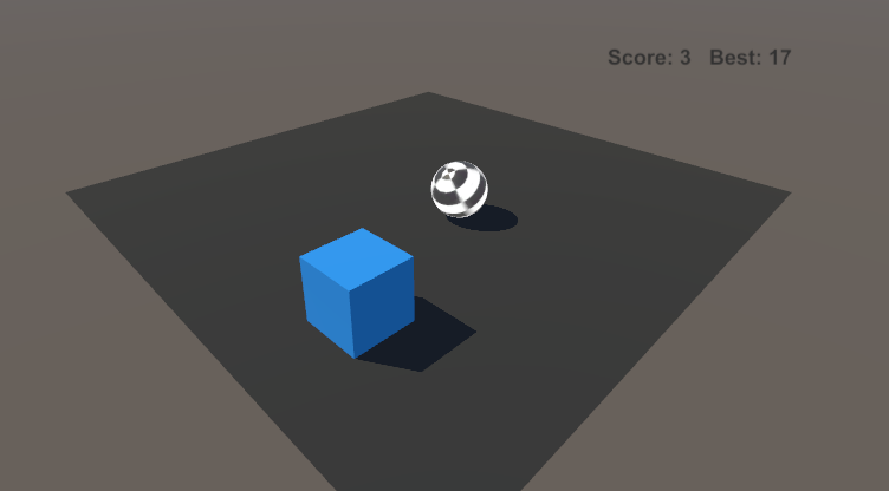

# RollerBall-UnityML

Small project for learning machine learning in Unity using [ML-Agents](https://github.com/Unity-Technologies/ml-agents). 

It is based on the following [tutorial](https://github.com/Unity-Technologies/ml-agents/blob/master/docs/Learning-Environment-Create-New.md) 
but please note that the tutorial is a bit broken in its current version (as of 180329). I changed what it observes and the rewards a bit. 
